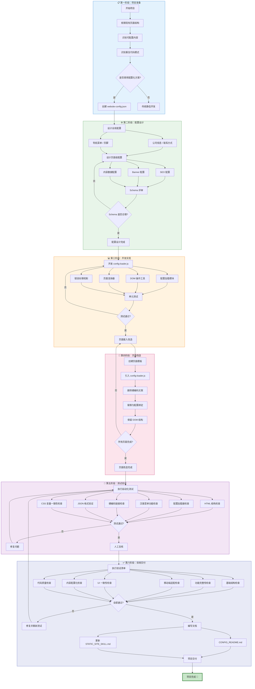

# 静态网站配置化建站流程图

> 基于 STATIC_SITE_SKILL.md 的标准工作流程

---

## 🗺️ 完整流程图



---

## 📊 流程详解

### 第一阶段：项目准备

| 步骤 | 任务 | 输出物 |
|------|------|--------|
| 梳理页面结构 | `ls *.html \| wc -l` | 页面清单 |
| 识别可配置内容 | 提取文案、图片、链接 | 配置项列表 |
| 识别重复代码 | `grep -c "async function applyConfig" *.html` | 重构优先级 |
| 方案决策 | 评估是否使用配置化 | 决策记录 |

**关键决策点**：项目内容是否频繁变更？是否有多人维护需求？

---

### 第二阶段：配置设计

#### 全局配置设计
```json
{
  "global": {
    "company": { "name": "", "slogan": "" },
    "contact": { "phone": "", "email": "", "address": "" },
    "navigation": { "items": [] },
    "footer": { "copyright": "", "links": [] }
  }
}
```

#### 页面级配置设计
```json
{
  "pageName": {
    "seo": { "title": "", "description": "" },
    "banner": { "title": "", "subtitle": "" },
    "content": { "sections": [] }
  }
}
```

**评审要点**：
- 配置项命名与 DOM 选择器是否对应？
- 相同结构是否使用数组？
- 是否预留扩展字段？

---

### 第三阶段：开发实现

#### config-loader.js 核心模块

```javascript
// 1. 配置加载
async function loadConfig() { }

// 2. 配置获取器
function getGlobalConfig() { }
function getPageConfig(pageName) { }

// 3. DOM 操作工具
function setText(selector, content) { }
function setHTML(selector, html) { }

// 4. 页面渲染器
function renderHomePage() { }
function renderAboutPage() { }

// 5. 自动初始化
function autoInit() { }
```

**测试要求**：
- [ ] 配置加载成功时正确渲染
- [ ] 配置加载失败时有降级方案
- [ ] 异步加载不阻塞页面渲染

---

### 第四阶段：页面改造

#### 标准页面模板

```html
<!DOCTYPE html>
<html lang="zh-CN">
<head>
  <meta charset="UTF-8"/>
  <meta name="viewport" content="width=device-width, initial-scale=1.0"/>
  <title><!-- 配置填充 --></title>
  <script src="config-loader.js"></script>
</head>
<body>
  <nav id="nav"><!-- 配置填充 --></nav>
  <main><!-- 配置填充 --></main>
  <footer><!-- 配置填充 --></footer>
</body>
</html>
```

**改造原则**：
1. 保留 DOM 结构，删除硬编码文案
2. 添加 `id` 或 `class` 供 JS 选择
3. 确保配置加载失败时页面仍可显示

---

### 第五阶段：测试验证

#### 自动化测试脚本

```bash
#!/bin/bash
# test.sh

echo "=== 1. HTML 结构完整性 ==="
for f in *.html; do
  tail -1 "$f" | grep -q "</html>" && echo "✅ $f" || echo "❌ $f"
done

echo "=== 2. 配置加载器引入 ==="
for f in *.html; do
  grep -q 'config-loader.js' "$f" && echo "✅ $f" || echo "⚠️ $f"
done

echo "=== 3. 汉堡菜单功能 ==="
for f in *.html; do
  grep -q "navLinks.classList.toggle('open')" "$f" && echo "✅ $f" || echo "⚠️ $f"
done

echo "=== 4. 硬编码链接检查 ==="
grep -n 'href="#"' *.html | head -10

echo "=== 5. JSON 格式验证 ==="
python3 -c "import json; json.load(open('website-config.json'))"

echo "=== 6. CSS 变量一致性 ==="
grep -l "var(--blue)" *.html | wc -l
```

---

### 第六阶段：验收交付

#### 验证清单（28 项）

<details>
<summary>📋 点击展开完整清单</summary>

**基础结构（5 项）**
- [ ] 配置文件 JSON 格式正确
- [ ] 所有 HTML 页面以 `</html>` 结尾
- [ ] 所有 HTML 页面引入 `config-loader.js`
- [ ] `<head>` 中包含 `<meta name="viewport">`
- [ ] `<head>` 中包含 `<meta charset="UTF-8">`

**功能完整性（5 项）**
- [ ] 全局配置（公司信息、联系方式）正确加载
- [ ] 各页面 SEO 配置正确加载
- [ ] 各页面 Banner 配置正确加载
- [ ] 修改配置后刷新页面生效
- [ ] 配置加载失败时页面正常显示

**移动端适配（5 项）**
- [ ] 所有页面有汉堡菜单按钮
- [ ] 点击汉堡菜单展开/收起导航
- [ ] 点击导航链接后自动关闭菜单
- [ ] 点击页面外部区域关闭菜单
- [ ] 导航滚动时添加阴影效果

**UI 一致性（5 项）**
- [ ] 所有页面使用统一的 CSS 变量
- [ ] 主题颜色一致（无突兀配色）
- [ ] Header 结构一致
- [ ] Footer 结构一致
- [ ] Banner 样式一致

**内容配置化（5 项）**
- [ ] 无硬编码的公司名称、联系方式
- [ ] 所有按钮有实际功能或可配置链接
- [ ] 下载链接已配置（非 `href="#"`）
- [ ] 图片 URL 使用 HTTPS
- [ ] 所有 `` 有 `alt` 属性

**代码质量（3 项）**
- [ ] 无 `console.log` 调试代码
- [ ] JS 语法无错误
- [ ] 文件编码统一为 UTF-8

</details>

---

## ⚠️ 关键风险点

| 风险 | 发生阶段 | 预防措施 |
|------|---------|---------|
| UI 不一致 | 页面改造 | 使用统一 CSS 变量，创建页面模板 |
| JS 代码截断 | 开发/部署 | 文件完整性检查，语法验证 |
| 配置与页面不同步 | 全流程 | 强制引入 config-loader.js |
| 移动端菜单失效 | 测试 | 真机测试，自动化功能检查 |
| 硬编码内容遗漏 | 验收 | 执行验证清单，代码审查 |

---

## 📈 流程优化建议

### 1. 建立项目模板
```
template/
├── index.html              # 包含基础结构的模板
├── css/
│   └── variables.css       # 统一 CSS 变量
├── js/
│   └── config-loader.js    # 标准加载器
├── config/
│   └── website-config.json # 配置示例
└── test/
    └── test.sh             # 标准测试脚本
```

### 2. CI/CD 集成
```yaml
# .github/workflows/test.yml
steps:
  - name: HTML 结构检查
    run: bash test.sh
  
  - name: JSON 格式验证
    run: python3 -c "import json; json.load(open('website-config.json'))"
  
  - name: 部署到 Vercel
    run: vercel --prod
```

### 3. 版本管理
- 配置文件变更历史记录
- 页面与配置版本对应关系
- 回滚机制

---

## 🎯 快速开始

```bash
# 1. 克隆模板
git clone template/ my-project
cd my-project

# 2. 修改配置
vim website-config.json

# 3. 运行测试
bash test.sh

# 4. 本地预览
python3 -m http.server 8000

# 5. 部署
vercel --prod
```

---

> 本文档与 STATIC_SITE_SKILL.md 配套使用
> 流程图文件：WORKFLOW.mmd（可在支持 Mermaid 的编辑器中查看）
